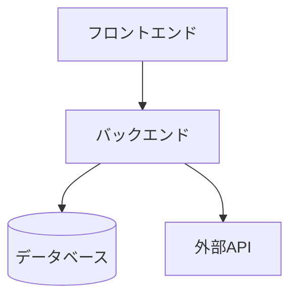

# Bug Analysis: Mermaid not displaying in composite slides with bulletList (H3)

## Issue Description

When a composite slide contains both:
1. A bulletList with H3 headings (`### Heading`)
2. A Mermaid diagram

The bulletList is completely missing from the parsed output, and only the Mermaid diagram is rendered.

## Reproduction

See the test fixture: `__tests__/fixtures/inputs/composite-list-mermaid-slide.md`

```markdown
## 3.2: リストとMermaid
- !複合: 1:2

- !リスト:
### システム構成の概要
- フロントエンド
- バックエンド
- データベース
### 各層の役割
- UIの提供
- ビジネスロジック
- データ永続化

- !Mermaid:

\`\`\`
```

## Expected Behavior

The parser should produce:
- `compositeItems` with 2 items:
  1. `bulletList` with H3 headings and nested items
  2. `code` (Mermaid) with the diagram

## Actual Behavior

The parser produces:
- `compositeItems` with only 1 item:
  1. `code` (Mermaid) with the diagram
- The `bulletList` is completely missing

## Root Cause

Located in [assets/md2html/parser/composite.js](assets/md2html/parser/composite.js), in the `parseCompositeItems` function (lines 200-374).

### The Problem

H3 headings (`### xxx`) are not markdown list items (they don't start with `-`), so they don't match the `PATTERNS.listItem` regex.

At lines 297-301:
```javascript
// Check indentation
const indentMatch = line.match(PATTERNS.listItem);
if (!indentMatch) {
  i++;
  continue;
}
```

**All non-list-item lines are skipped**, including H3 headings.

### Why H3 works for cards but not bulletList

H3 headings ARE processed for `cards` type (lines 278-294):
```javascript
// Check for H3 card header (### Card Name)
const h3Match = trimmed.match(PATTERNS.cardH3);
if (h3Match && currentItem && currentItem.type === 'cards') {
  // ... process H3 for cards
  i++;
  continue;
}
```

However:
1. This check only runs when `currentItem.type === 'cards'`
2. For `bulletList`, H3 headings are skipped before reaching the content processing logic
3. This causes the `bulletList` item to have empty `items: []`
4. Empty items are filtered out in `finalizeCompositeItem` (lines 74-76)

### Execution Flow (Current Buggy Behavior)

1. Line `- !複合: 1:2` → Parse composite layout
2. Line `- !リスト:` → Create `currentItem = { type: 'bulletList', items: [] }`
3. Line `### システム構成の概要` → **SKIPPED** (not a list item, line 297-301)
4. Lines `- フロントエンド`, etc. → **SKIPPED** (H3 was skipped, so structure is broken)
5. Eventually, `currentItem` has `items: []` and is filtered out
6. Line `- !Mermaid:` → Create new `currentItem = { type: 'code', ... }`
7. Code block is parsed correctly
8. Final result: Only Mermaid item

## Fix Requirements

To fix this bug, the parser needs to:

1. **Handle H3 headings for bulletList** (not just cards)
2. **Process H3 headings before the `indentMatch` check** (they need special handling)
3. **Store H3 headings as items in bulletList** with `isHeading: true` property
4. **Process subsequent list items as sub-items** under the H3 heading

The standalone `bulletList` parser ([assets/md2html/parser/bullet-list.js](assets/md2html/parser/bullet-list.js)) already handles H3 correctly (lines 16-19):
```javascript
// Check for h3 heading (### xxx)
const headingMatch = line.match(/^###\s+(.+)$/);
if (headingMatch) {
  return { indent: 0, content: headingMatch[1], isHeading: true };
}
```

The composite parser should adopt similar logic.

## Test Case

A reproduction test has been added: [assets/__tests__/composite-list-mermaid-bug.test.mjs](assets/__tests__/composite-list-mermaid-bug.test.mjs)

Run with:
```bash
cd assets && npx vitest run __tests__/composite-list-mermaid-bug.test.mjs
```

The test currently **fails** as expected, confirming the bug.

## Impact

This bug affects any composite slide that uses:
- `!リスト:` with H3 headings (`###`)
- Combined with any other element type (Mermaid, code, table, etc.)

The bulletList content is completely lost, breaking the slide layout.

## Related Files

- **Parser**: `assets/md2html/parser/composite.js` (parseCompositeItems function)
- **Test fixture**: `__tests__/fixtures/inputs/composite-list-mermaid-slide.md`
- **Reproduction test**: `assets/__tests__/composite-list-mermaid-bug.test.mjs`
- **Working reference**: `assets/md2html/parser/bullet-list.js` (shows how H3 should be handled)
