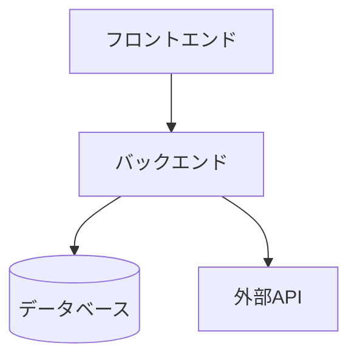

# 複合スライドテスト（リスト + Mermaid）

---

## 3.2: リストとMermaid
- !複合: 1:2

- !リスト:
### システム構成の概要
- フロントエンド
- バックエンド
- データベース
### 各層の役割
- UIの提供
- ビジネスロジック
- データ永続化

- !Mermaid:

```mermaid
flowchart TD
    A[フロントエンド] --> B[バックエンド]
    B --> C[(データベース)]
    B --> D[外部API]
```
