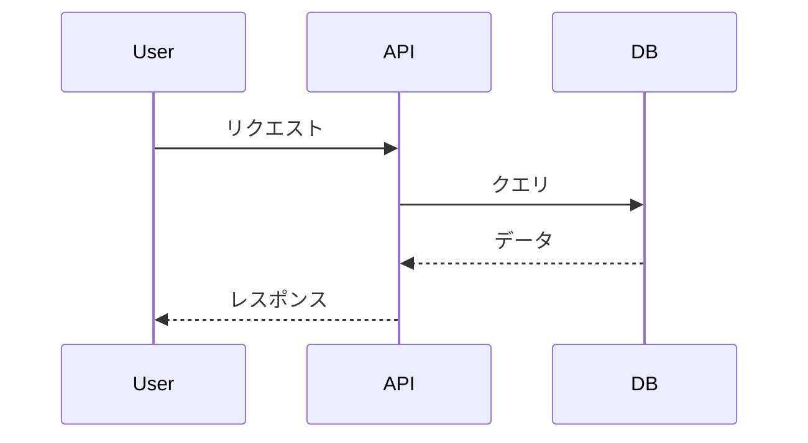

# Mermaidスライドテスト

---

## 3.1: シーケンス図
- Mermaid:

```mermaid
sequenceDiagram
    participant User
    participant API
    participant DB
    User->>API: リクエスト
    API->>DB: クエリ
    DB-->>API: データ
    API-->>User: レスポンス
```
