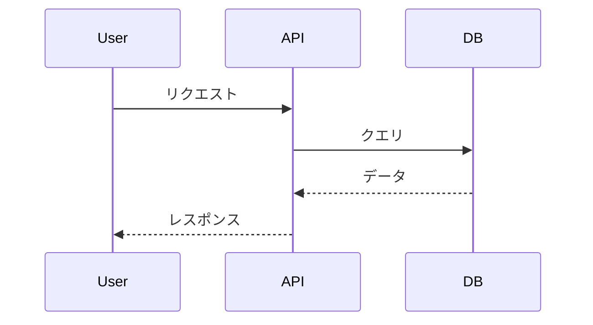
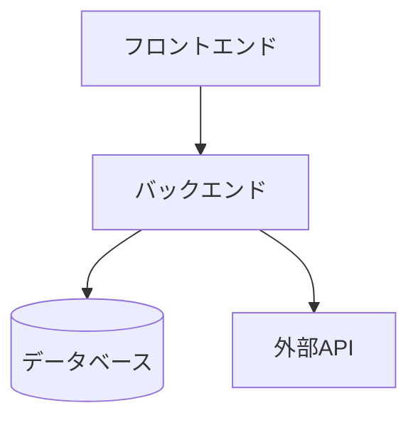
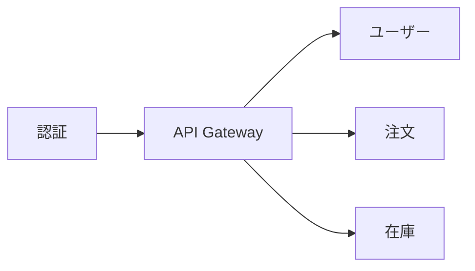

# md2html2pptx サンプル

各スライドタイプのデモンストレーションです。

---

## PART 1: md2html2pptx
- 副題: Markdownからスライドを作成

## 1.1: md2html2pptxとは
- !リスト:
### MarkdownからPowerPointを生成するツール
- シンプルな記法でスライドを記述
- 学習コストが低い
  - 既存のMarkdown知識を活用
### HTML経由で高品質な変換を実現
- 一貫したスタイリング
  - 全スライドで統一感
### Claudeと連携して効率的にスライド作成
- 自然言語で指示可能
  - 「〜のスライドを作って」で生成

## 1.2: 3つの特徴
- !カード:
### シンプル
- Markdownで記述
- 特別な知識不要
### 高品質
- プロ仕様のデザイン
- 一貫したスタイル
### 高速
- 数秒で変換完了
- 即座にプレビュー

## 1.3: 使い方
- layout: vertical
- !ステップ:
### セットアップ
- npm install を実行
### Markdown作成
- 1_mds/ にファイルを配置
### HTML生成
- to_html コマンドを実行
### PPTX出力
- to_pptx コマンドを実行

## 1.4: スライドタイプ一覧
- !テーブル:
| タイプ | 説明 | 用途 |
|--------|------|------|
| title | タイトルスライド | 表紙・セクション区切り |
| content | 箇条書き | 説明・リスト |
| cards | カードレイアウト | 比較・並列情報 |
| code | コードブロック | ソースコード表示 |

## 1.5: Markdown記述のポイント
- !Good:
### 推奨
- 簡潔な箇条書き
- 適切な階層構造
- 一貫した書式

- !Bad: 
### 非推奨
- 長すぎる文章
- 深すぎるネスト
- 混在したスタイル

## 1.6: TypeScriptの例

- !コード:
```typescript
interface Slide {
  type: 'title' | 'content' | 'cards';
  title: string;
  items?: string[];
}

function generateSlide(slide: Slide): string {
  return `<div class="slide">${slide.title}</div>`;
}
```

## 1.7: Pythonの例

- !コード:
```python
from dataclasses import dataclass
from typing import List

@dataclass
class Slide:
    title: str
    items: List[str]

def generate_html(slide: Slide) -> str:
    return f"<h1>{slide.title}</h1>"
```

## 1.9: まとめ
- !リスト:
### Markdownで簡単にスライド作成
### 複数のレイアウトタイプに対応
### 高品質なPowerPointを自動生成

## 2.1: 命名規則の比較
- !複合: 1:2

- !Good: 
### 推奨
- 明確な変数名
- 意図が伝わる命名

- !Bad: 
### 非推奨
- 略語の多用
- 意味不明な名前

- !コード:
```typescript
// Good: 明確な命名
const userName = "Alice";
const isLoggedIn = true;

// Bad: 不明瞭な命名
const u = "Alice";
const f = true;
```

## 2.2: コーディング規約
- !複合: 2:1
- !Good: 
### 推奨
- 一貫したスタイル
- チームで統一

- !Bad: 
### 非推奨
- バラバラなスタイル
- 個人の好み優先

- !テーブル:
| 項目 | 推奨 | 非推奨 |
|------|------|--------|
| インデント | 2スペース | タブ混在 |
| 命名 | camelCase | snake_case混在 |

## 2.3: 開発プロセス
- !複合: 2:1

- !カード: 
### 目的
- 品質の担保
- 効率的な開発
### 成果物
- テスト済みコード
- ドキュメント

### 設計
- 要件を整理
### 実装
- コードを書く
### テスト
- 動作確認

## 2.4: CI/CDパイプライン
- !複合: 2:1
- !リスト:

### 自動化されたビルド・テスト・デプロイ
### 品質を継続的に担保
- Push
- Build
- Test
- Deploy

## PART 2: レイアウトバリエーション
- 副題: 様々なレイアウトパターン

## 2.5: 2x2グリッド比較
- !複合: 2:2
- !カード: 
### フロントエンド
- React / Vue
- TypeScript
### バックエンド
- Node.js / Python
- REST API
### インフラ
- AWS / GCP
- Docker
### CI/CD
- GitHub Actions
- 自動デプロイ

## 2.6: カード4枚横並び
- !カード: 
### 計画
- 要件定義
- 設計

### 開発
- 実装
- レビュー
### テスト
- 単体
- 結合
### リリース
- デプロイ
- 監視

## 2.7: コード比較
- !複合: 1:2
- !コード:
```javascript
// JavaScript
const add = (a, b) => a + b;
console.log(add(1, 2));
```

- !コード:
```python
# Python
def add(a, b):
    return a + b
print(add(1, 2))
```

## 2.8: 詳細テーブル
- !テーブル:
| 機能 | 無料 | Pro | Enterprise |
|------|------|-----|------------|
| ユーザー数 | 5人 | 50人 | 無制限 |
| ストレージ | 1GB | 100GB | 無制限 |
| サポート | メール | チャット | 24/7電話 |
| API | 制限あり | 制限なし | 制限なし |

## PART 3: Mermaid図表
- 副題: Mermaidダイアグラムの活用例

## 3.1: シーケンス図
- !Mermaid:


## 3.2: リストとMermaid
- !複合: 1:2

- !リスト:
### システム構成の概要
- フロントエンド
- バックエンド
- データベース
### 各層の役割
- UIの提供
- ビジネスロジック
- データ永続化

- !Mermaid:


## 3.3: カードとMermaid
- !複合: 1:2
- !リスト:
### アーキテクチャ
- マイクロサービス構成
- 各サービスは独立
- APIで連携

- !Mermaid:


## リーンキャンバス: シンプルツール
### 日付:
- 202401
### 課題:
- 既存ツールが複雑すぎる
- 学習コストが高い
### ソリューション:
- シンプルなUI
- ワンクリック操作
### 独自の価値提案:
- 誰でも5分で使える
### 競合優位性:
- 特許技術
- 専門チーム
### 顧客セグメント:
- 中小企業の経営者
- ITに不慣れな担当者
### 主要指標:
- MAU
- 継続率
### チャネル:
- Web広告
- 口コミ
### コスト構造:
- サーバー費用
- 人件費
### 収益の流れ:
- 月額サブスク
- エンタープライズ契約

## 推し活サポートアプリ
- !ジャベリンボード:
### 2024-01: SNS巡回の負担
#### 顧客の行動仮説:
- 推しの情報を毎日チェック
#### 課題仮説:
- 複数SNSの巡回が大変
#### 価値/解決法仮説:
- 一括通知で見逃し防止
#### 前提:
- 3つ以上のSNSを利用
#### 検証方法と達成基準:
- 10人インタビュー、7人共感
#### 結果:
- 8/10人共感
#### 学びと判断:
- 継続

### 2024-02: グッズ購入の機会損失
#### 顧客の行動仮説:
- グッズ購入に月1万円以上
#### 課題仮説:
- 発売日を忘れて買い逃す
#### 価値/解決法仮説:
- カレンダー連携でリマインド
#### 前提:
- スマホカレンダーを利用
#### 検証方法と達成基準:
- MVP提供、継続率50%
#### 結果:
- 継続率65%
#### 学びと判断:
- 継続

### 2024-03: ファン同士の交流場
#### 顧客の行動仮説:
- 同担と情報交換したい
#### 課題仮説:
- 既存SNSでは荒れやすい
#### 価値/解決法仮説:
- クローズドコミュニティ
#### 前提:
- 安全な交流を求めている
#### 検証方法と達成基準:
- β版100人、DAU30%
#### 結果:
- DAU12%、情報共有のみ活発
#### 学びと判断:
- ピボット

### 2024-04: 推し活仲間とのグッズ共有
#### 顧客の行動仮説:
- グッズ情報を仲間と共有したい
#### 課題仮説:
- 個別連絡が手間
#### 価値/解決法仮説:
- グループ共有機能
#### 前提:
- 3人以上の推し活仲間
#### 検証方法と達成基準:
- β版50人、週次投稿率60%
#### 結果:
- 週次投稿率85%、NPS70
#### 学びと判断:
- 本開発へ

## 推し活サポートアプリ
- !カスタマージャーニー:
### 認知
#### 行動:
- SNSで投稿を閲覧
- 友人から話を聞く
#### タッチポイント:
- SNS広告
- 友人の口コミ
#### ペイン:
- 複数SNS見るの大変
#### ゲイン:
- 効率化できそう

### 検討
#### 行動:
- レビュー確認
- 公式サイトチェック
#### タッチポイント:
- アプリストア
- 公式サイト
#### ペイン:
- 使いやすいか不安
#### ゲイン:
- 評判が良さそう

### 購入/利用
#### 行動:
- 毎日推しの情報をチェック
- グッズを飾ったり身につけたり
- 推しの出演番組を録画・視聴
- ファンコミュニティに参加
- 自分の推し語りを投稿
- 他のファンと交流
#### タッチポイント:
- 公式SNSアカウント
- 推し活専用の部屋・スペース
- 録画機器・配信サービス
- ファンコミュニティ（SNS、掲示板）
- オフ会・ファンミーティング
- ファン同士のDM
#### ペイン:
- 推し活に時間とお金を使いすぎて本業がおろそかに
- 「にわかは黙ってて」と言われて傷つく
#### ゲイン:
- 毎日推しを見られて幸せ 充実感
- 予算と時間を決めて計画的に管理
- 同じ推しの人と繋がれる ワクワク
- 同じペースの仲間や優しい先輩に出会う

### 継続/推奨
#### 行動:
- プレミアム登録
- 友人に紹介
#### タッチポイント:
- プレミアム機能
- 紹介プログラム
#### ペイン:
- 有料の価値
#### ゲイン:
- 欠かせないツール

## PART 4: テーブル複合レイアウト
- 副題: テーブルを含む複合レイアウトパターン

## 4.1: 左右分割テーブル
- !複合: 1:2

- !テーブル:
| 機能 | 対応 |
|------|------|
| 自動保存 | ○ |
| 履歴管理 | ○ |
| 共有機能 | △ |

- !カード: 
### 補足説明
- 自動保存は5分間隔
- 履歴は30日間保持
- 共有は有料プランのみ

## 4.2: 3列レイアウトとテーブル
- !複合: 1:1:1

- !カード: 
### プランA
- 月額: 500円
- 容量: 10GB
### プランB
- 月額: 1000円
- 容量: 50GB
  
- !テーブル:
| 項目 | A | B |
|------|---|---|
| 価格 | 安 | 中 |
| 機能 | 基本 | 拡張 |

## 4.3: テーブル2つ横並び
- !複合: 1:2
- !テーブル:

| 前期 | 売上 |
|------|------|
| Q1 | 100万 |
| Q2 | 120万 |

- !テーブル:

| 後期 | 売上 |
|------|------|
| Q3 | 150万 |
| Q4 | 180万 |
