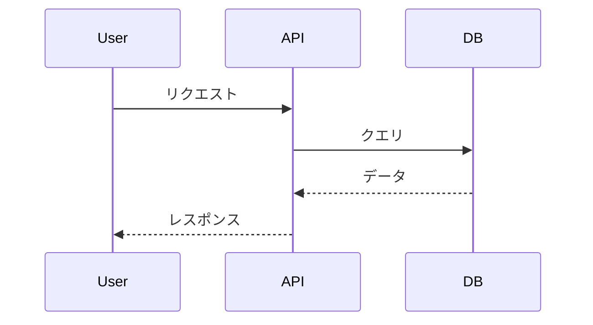
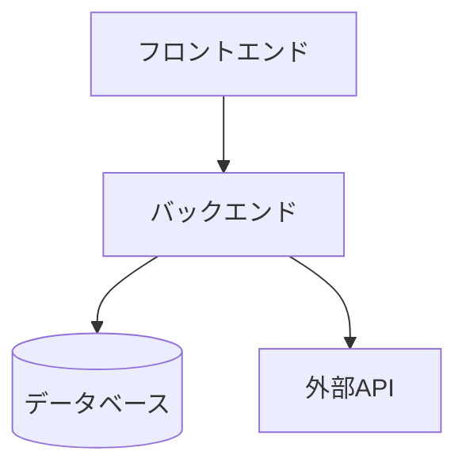
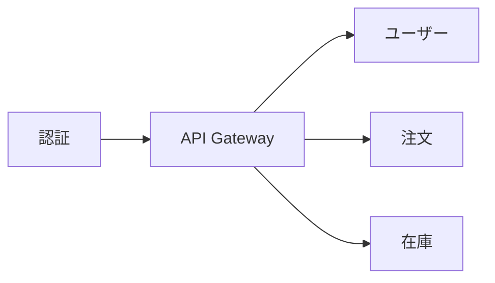

# md2html2pptx サンプル

各スライドタイプのデモンストレーションです。

---

## PART 1: md2html2pptx
- 副題: Markdownからスライドを作成

## 1.1: md2html2pptxとは
- リスト:
  - MarkdownからPowerPointを生成するツール
    - シンプルな記法でスライドを記述
    - 学習コストが低い
      - 既存のMarkdown知識を活用
  - HTML経由で高品質な変換を実現
    - 一貫したスタイリング
      - 全スライドで統一感
  - Claudeと連携して効率的にスライド作成
    - 自然言語で指示可能
      - 「〜のスライドを作って」で生成

## 1.2: 3つの特徴
- カード1: シンプル
  - Markdownで記述
  - 特別な知識不要
- カード2: 高品質
  - プロ仕様のデザイン
  - 一貫したスタイル
- カード3: 高速
  - 数秒で変換完了
  - 即座にプレビュー

## 1.3: 使い方
- layout: vertical
- ステップ1: セットアップ
  - npm install を実行
- ステップ2: Markdown作成
  - 1_mds/ にファイルを配置
- ステップ3: HTML生成
  - to_html コマンドを実行
- ステップ4: PPTX出力
  - to_pptx コマンドを実行

## 1.4: スライドタイプ一覧
- テーブル:

| タイプ | 説明 | 用途 |
|--------|------|------|
| title | タイトルスライド | 表紙・セクション区切り |
| content | 箇条書き | 説明・リスト |
| cards | カードレイアウト | 比較・並列情報 |
| code | コードブロック | ソースコード表示 |

## 1.5: Markdown記述のポイント
- Good: 推奨
  - 簡潔な箇条書き
  - 適切な階層構造
  - 一貫した書式
- Bad: 非推奨
  - 長すぎる文章
  - 深すぎるネスト
  - 混在したスタイル

## 1.6: TypeScriptの例

```typescript
interface Slide {
  type: 'title' | 'content' | 'cards';
  title: string;
  items?: string[];
}

function generateSlide(slide: Slide): string {
  return `<div class="slide">${slide.title}</div>`;
}
```

## 1.7: Pythonの例

```python
from dataclasses import dataclass
from typing import List

@dataclass
class Slide:
    title: str
    items: List[str]

def generate_html(slide: Slide) -> str:
    return f"<h1>{slide.title}</h1>"
```

## 1.8: 変換フロー
- フロー:
  - Markdown
  - Parser
  - HTML
  - PPTX

## 1.9: まとめ
- リスト:
  - Markdownで簡単にスライド作成
  - 複数のレイアウトタイプに対応
  - 高品質なPowerPointを自動生成

## 2.1: 命名規則の比較
- 複合: 1:2
  - Good: 推奨
    - 明確な変数名
    - 意図が伝わる命名
  - Bad: 非推奨
    - 略語の多用
    - 意味不明な名前
  - コード:

```typescript
// Good: 明確な命名
const userName = "Alice";
const isLoggedIn = true;

// Bad: 不明瞭な命名
const u = "Alice";
const f = true;
```

## 2.2: コーディング規約
- 複合: 2:1
  - Good: 推奨
    - 一貫したスタイル
    - チームで統一
  - Bad: 非推奨
    - バラバラなスタイル
    - 個人の好み優先
  - テーブル:

| 項目 | 推奨 | 非推奨 |
|------|------|--------|
| インデント | 2スペース | タブ混在 |
| 命名 | camelCase | snake_case混在 |

## 2.3: 開発プロセス
- 複合: 2:1
  - カード1: 目的
    - 品質の担保
    - 効率的な開発
  - カード2: 成果物
    - テスト済みコード
    - ドキュメント
  - ステップ1: 設計
    - 要件を整理
  - ステップ2: 実装
    - コードを書く
  - ステップ3: テスト
    - 動作確認

## 2.4: CI/CDパイプライン
- 複合: 2:1
  - リスト:
    - 自動化されたビルド・テスト・デプロイ
    - 品質を継続的に担保
  - フロー:
    - Push
    - Build
    - Test
    - Deploy

## PART 2: レイアウトバリエーション
- 副題: 様々なレイアウトパターン

## 2.5: 2x2グリッド比較
- 複合: 2:2
  - カード1: フロントエンド
    - React / Vue
    - TypeScript
  - カード2: バックエンド
    - Node.js / Python
    - REST API
  - カード3: インフラ
    - AWS / GCP
    - Docker
  - カード4: CI/CD
    - GitHub Actions
    - 自動デプロイ

## 2.6: カード4枚横並び
- カード1: 計画
  - 要件定義
  - 設計
- カード2: 開発
  - 実装
  - レビュー
- カード3: テスト
  - 単体
  - 結合
- カード4: リリース
  - デプロイ
  - 監視

## 2.7: コード比較
- 複合: 1:2
  - コード:

```javascript
// JavaScript
const add = (a, b) => a + b;
console.log(add(1, 2));
```

  - コード:

```python
# Python
def add(a, b):
    return a + b
print(add(1, 2))
```

## 2.8: 詳細テーブル
- テーブル:

| 機能 | 無料 | Pro | Enterprise |
|------|------|-----|------------|
| ユーザー数 | 5人 | 50人 | 無制限 |
| ストレージ | 1GB | 100GB | 無制限 |
| サポート | メール | チャット | 24/7電話 |
| API | 制限あり | 制限なし | 制限なし |

## 2.9: 開発フロー
- フロー:
  - 企画
  - 設計
  - 開発
  - テスト
  - リリース

## PART 3: Mermaid図表
- 副題: Mermaidダイアグラムの活用例

## 3.1: シーケンス図
- Mermaid:



## 3.2: リストとMermaid
- 複合: 1:2
  - リスト:
    - システム構成の概要
      - フロントエンド
      - バックエンド
      - データベース
    - 各層の役割
      - UIの提供
      - ビジネスロジック
      - データ永続化
  - Mermaid:



## 3.3: カードとMermaid
- 複合: 1:2
  - カード1: アーキテクチャ
    - マイクロサービス構成
    - 各サービスは独立
    - APIで連携
  - Mermaid:


