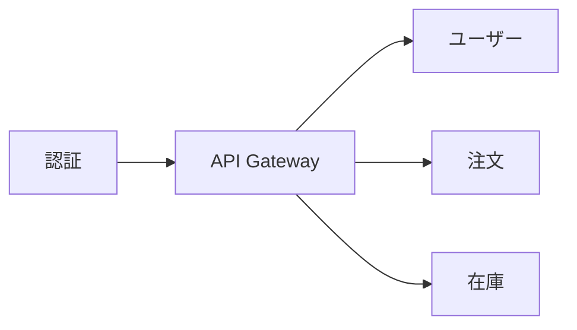

# 複合スライドテスト（カード + Mermaid）

---

## 3.3: カードとMermaid
- 複合: 1:2
  - カード1: アーキテクチャ
    - マイクロサービス構成
    - 各サービスは独立
    - APIで連携
  - Mermaid:

```mermaid
flowchart LR
    A[認証] --> B[API Gateway]
    B --> C[ユーザー]
    B --> D[注文]
    B --> E[在庫]
```
